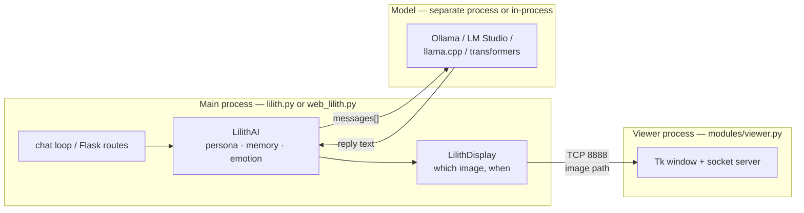

# How Lilith works

A map of the codebase: what each piece does, how a message becomes a reply and
a facial expression, and which invariants you break at your peril.

For installing and using her, see [README.md](README.md). This document is for
people changing the code.

---

## The shape of it

Lilith is three cooperating processes, not one program.



The split exists for one reason: **Tk owns its thread and never gives it
back.** There is no clean way to push an image into a running `mainloop()`
from outside, so the portrait lives in its own process and is fed file paths
over a socket. Everything awkward about the display layer follows from that.

The two local backends (`llama`, `hf`) load the model inside the main process
instead; only `ollama` and `lm studio` are genuinely separate servers.

---

## Layers

Four layers, each depending only on the ones above it.

| Layer | Files | Responsibility |
|---|---|---|
| **Foundation** | `compat.py`, `theme.py`, `_tui.py` | Paths, config, console encoding, colour, DPI, logging. Knows nothing about Lilith. |
| **Brain** | `lilith_ai.py`, `lilith_memory.py`, `persona_guard.py`, `_iface.py`, `_*_iface.py` | Persona, memory, context budgeting, backend dispatch. No UI, no GUI. |
| **Face** | `lilith_display.py`, `_viewer_iface.py`, `viewer.py` | Emotion → image → window. |
| **Interfaces** | `lilith.py`, `web_lilith.py`, `config_edit.py`, `conv_mgmt.py`, `first_run.py`, `doctor.py` | The ways a human reaches the brain. |

`modules/compat.py` is the file to read first. Everything imports it.

### Foundation

**`compat.py`** — the answer to "am I on Windows or Linux?" so nothing else
has to ask.

- `BASE_DIR` is derived from `__file__`, never the working directory
  ([compat.py:40](modules/compat.py#L40)), so Lilith runs from anywhere.
- `load_config()` copies `config.example.ini` into place if `config.ini` is
  missing, then fills every absent key from `CONFIG_DEFAULTS`
  ([compat.py:65](modules/compat.py#L65)). **A missing key can never raise
  `KeyError`** — this is why the rest of the code reads config without guards.
- `enable_utf8_console()` switches the Windows console to code page 65001, but
  only when stdout is a real tty — the code page is a property of the *window*,
  not the process, so doing it during a redirect would silently reconfigure the
  user's terminal for every later program. `restore_console_cp()` puts it back.
- `safe_text()` downgrades typography (`…` → `...`) on consoles that cannot
  encode it. This matters beyond looks: [lilith.py:38](lilith.py#L38) keys its
  per-character typing delay on `U+2026`, so a mangled ellipsis silently killed
  her trailing-off pause.
- `replace_atomic()` is `os.replace` with retries, because Windows antivirus
  routinely holds a transient lock on a just-written file.
- `port_in_use()` exists because `SO_REUSEADDR` means the *opposite* thing on
  Windows: two processes really can bind one port, so you must check first.

**`theme.py`** — colour that never crashes. Emitted only when `NO_COLOR` is
unset, `TERM` isn't `dumb`, the stream is a tty, and on Windows
`ENABLE_VIRTUAL_TERMINAL_PROCESSING` was actually accepted. 256-colour codes
degrade to basic-8 rather than being emitted blindly. `curses.wrapper` restores
the console mode it captured at `initscr()`, which clears the VT flag — so call
`theme.reset()` after any curses screen or the cache goes stale.

**`_tui.py`** — `curses` is not in the stdlib on Windows. This provides
`load_curses()` with a `pip install windows-curses` hint, a numbered-menu
fallback when it's genuinely absent, and `safe_addstr()`, which clips.
Never call `stdscr.addstr` directly: it raises past the last row or column.

---

## A turn, end to end

This is the path worth understanding. Everything else is support.

```mermaid
sequenceDiagram
    participant U as You
    participant L as lilith.py
    participant AI as LilithAI
    participant PG as persona_guard
    participant B as backend
    participant D as LilithDisplay
    participant V as viewer

    U->>L: "are you real?"
    L->>D: show_lilith("thinking_happy")
    D->>V: image path over TCP
    L->>AI: lilith_reply(prompt)
    AI->>AI: _build_payload → [system] + fitted history + [user]
    AI->>B: get_response(messages)
    B-->>AI: "...i'm here. [state:thinking_sad]"
    AI->>PG: find_leak(raw)
    Note over AI,PG: diagnostic only; never replace safety/identity content
    AI->>AI: _extract_state → strip [state:x]
    AI->>AI: append turns, save memory.json
    AI-->>L: reply text
    L->>D: show_lilith(emotion)
    D->>V: image path
    L->>U: typed out, character by character
```

### 1. Prompt assembly

The payload is **rebuilt from scratch every turn**
([lilith_ai.py:381](modules/lilith_ai.py#L381)):

```
[ system: persona + "The person you are speaking with is called X" + time context ]
[ ...fitted history... ]
[ user: this message ]
```

Stored history holds *only* `user`/`assistant` turns. System turns used to be
persisted inside it, which meant an edited `lilith_persona.txt` was silently
overridden by the stale copy on disk and you paid for the persona twice.
`_ensure_conversations()` strips any such legacy turns on load
([lilith_ai.py:207](modules/lilith_ai.py#L207)).

Rebuilding is also what makes time awareness possible at all — `_time_context()`
injects the current hour and how long you were away, freshly, each turn.

### 2. Context budgeting

The subtle part. Trimming by message *count* is not enough, because the persona
is a fixed cost of thousands of tokens that is never trimmed. Once
persona + history crossed `n_ctx`, every turn failed permanently.

`_fit_history()` ([lilith_ai.py:335](modules/lilith_ai.py#L335)) computes:

```
room = context_limit − max_tokens − 256 − tokens(system) − tokens(prompt)
```

then walks history **backwards**, keeping turns while they fit (`+4` per
message for the chat template's role delimiters). Two details matter:

- `context_limit` comes from the backend when it can say so; the HTTP backends
  own no tokenizer, so they return `None` and it falls back to `n_ctx`.
  Likewise `_count_tokens` estimates at `len // 3` — deliberately high, so it
  under-fills rather than overflows.
- The kept history **must not open on an assistant turn**. Strict-alternation
  templates (Gemma, Mistral) reject that outright, so leading assistant turns
  are popped ([lilith_ai.py:373](modules/lilith_ai.py#L373)).

If `room <= 0`, it sends no history at all and logs why, rather than failing.

### 3. Persona guard

`persona_guard.find_leak()` detects a small set of generic customer-service
phrases before storage and logs them for diagnostics. It does not rewrite or
regenerate the answer: a stylistic retry could suppress a truthful AI identity
statement, capability limit, or safety refusal. Protected disclosures are also
excluded from retroactive cleanup when mixed with a generic phrase.

`sanitize_memory.py` applies a narrower, whole-reply version of the same patterns
retroactively. It preserves every mixed reply with surrounding content so a
refusal or identity disclosure cannot be deleted by a trailing service phrase.

### 4. Emotion

Two mechanisms, in priority order:

1. **Explicit tag.** Lilith is asked to end replies with `[state:thinking_sad]`.
   `_extract_state()` pulls it out, validates against `VALID_STATES`, and
   strips it from the visible text.
2. **Keyword fallback**, when a model ignores the tag. Two tables:
   `EXTENDED_EMOTIONS` (the `room` art set) and `BASIC_EMOTIONS` (`glass`).

Both tables are **ordered longest-phrase-first**. This is load-bearing:
`"thinking happy"` contains `"happy"`, so with the naive ordering the happy
branch always won and `thinking_happy` was dead code.

Asking whether she is real is special-cased — `EXISTENCE_KEYWORDS` matched on
word boundaries, not substrings, so "I'm learning programming today" no longer
makes her look disappointed.

### 5. Display

`LilithDisplay` resolves an emotion to an image that the current art set
actually contains, via `EMOTION_FALLBACKS`
([lilith_display.py:43](modules/lilith_display.py#L43)):

```
"playful" → playful → cheeky → smile → idle
```

`room` and `glass` hold different expressions, so this chain is what lets them
share one emotion vocabulary. `tests/test_compat.py` enforces that every state
in `VALID_STATES` is resolvable.

**The revert token.** After showing an emotion, a timer returns her to `idle`
after `revert_delay`. Cancellation uses a monotonically increasing token, not a
timestamp. Blinks pass `transient=True` so they *don't* bump it — otherwise any
blink landing between an emotion and its revert cancelled the timer, and since
the blink restores the previous state with `schedule_revert=False`, no new
timer replaced it. With a 5s revert and a 4–8s blink, that fired most turns and
froze her expression ([lilith_display.py:187](modules/lilith_display.py#L187)).

---

## The viewer protocol

Deliberately tiny. Wire format:

```
┌──────────────┬───────────────────────┐   ┌──────────┐
│ 4-byte LE len│  UTF-8 path (≤4096 B) │ → │ 1-byte ack│
└──────────────┴───────────────────────┘   └──────────┘
                                     0x01 = loaded, 0x00 = failed
```

`struct.Struct("<I")` — explicitly little-endian, not native `"I"`, which used
native size *and alignment* and made the protocol architecture-dependent.

Three things this layer must get right:

- **Sends are serialised with a lock** ([_viewer_iface.py:92](modules/_viewer_iface.py#L92)).
  The blink thread, the revert timer and the main thread all share one socket;
  interleaved writes desynchronise the length-prefixed stream, which appears as
  the portrait freezing on a random frame.
- **Images are applied on the Tk thread.** Tk is not thread-safe, so the socket
  thread marshals via `root.after(0, task)` and waits on an `Event`
  ([viewer.py:279](modules/viewer.py#L279)).
- **Listening starts inside the mainloop.** `start_background` is scheduled with
  `root.after(0, ...)` because `wait_for_server()` returns the instant `listen()`
  accepts — bind before `mainloop()` and the first frame can arrive with no loop
  to schedule onto, raising into a swallowed exception.

### Lifecycle

The viewer is spawned with `--parent-pid` and polls it once a second. On
Windows a child is not reaped with its parent, so without this, closing Lilith
left an orphan window holding port 8888 forever.

`parent_alive()` ([viewer.py:68](modules/viewer.py#L68)) avoids
`os.kill(pid, 0)` on Windows, where `os.kill` is implemented with
`TerminateProcess` and would *kill* the parent rather than probe it. It uses
`OpenProcess` + `WaitForSingleObject`, and treats a failure to *open* as alive —
an elevated parent gives `ACCESS_DENIED` for a perfectly live process, and
reading that as "dead" made the portrait destroy itself a second after startup.

---

## Memory

`memory.json`, gitignored, schema:

```json
{
  "meta": { "user_name": "...", "user_name_set": true, "last_seen": "ISO-8601" },
  "conversations": { "default": [ {"role": "user", "content": "..."} ] },
  "current_conversation": "default"
}
```

"Rooms" in the UI are keys under `conversations`.

**Writes are atomic**: temp file → `flush` → `fsync` → `os.replace`
([lilith_memory.py:162](modules/lilith_memory.py#L162)). The old code truncated
before writing, so Ctrl+C mid-save wiped every conversation.

**Cross-process merging.** Both locks in this codebase are per-instance and do
nothing across processes, yet the terminal app, `conv_edit` and the web UI each
hold a full snapshot and rewrite the whole file. `LilithMemory` stamps
`(mtime_ns, size)` at every read and write; if the stamp changed underneath it,
`_absorb_foreign_rooms()` folds in rooms that exist on disk but not in memory.

The merge is deliberately one-directional — it only *adds*. Our copy wins for
rooms we already know about. The tradeoff: deleting a room in one process while
another has it loaded can resurrect it. That is the safe direction to fail, and
it's why the README says to prefer one process at a time.

A corrupt `memory.json` is copied to `memory.corrupt-<timestamp>.json` and
treated as blank rather than discarded. `UnicodeDecodeError` is caught alongside
`JSONDecodeError` because it subclasses `ValueError`, not `JSONDecodeError`, and
used to escape uncaught — skipping the backup in exactly the case where a file
had been mangled.

---

## Backends

`_iface.AIInterface` dispatches on `[server] server_ai` through a table
([_iface.py:25](modules/_iface.py#L25)):

| Value | Module | Transport |
|---|---|---|
| `ollama` | `_ollama_iface.py` | HTTP to a local Ollama server |
| `lm studio` / `openai` | `_openai_iface.py` | OpenAI-compatible HTTP |
| `llama` | `_llama_iface.py` | GGUF loaded in-process via llama.cpp |
| `hf` | `_hf_iface.py` | transformers loaded in-process |

`normalise_backend()` accepts `LM studio`, `lm_studio`, `LMStudio` as one value.

Every backend defers its heavy third-party import into `__init__`/`load()`, so
merely *selecting* a backend never pays for torch. That means importing the
wrapper module can't fail, and the whole construction chain — not just
`import_module` — must be wrapped to turn a missing dependency into
`BackendUnavailable` with the exact install command for the current OS.

Two optional capabilities are duck-typed, never assumed: `count_tokens()` and
`context_limit`. Only the in-process backends own a tokenizer.

**The `llama` backend never downloads.** `find_gguf()`
([_llama_iface.py](modules/_llama_iface.py)) looks in `model_path` and nowhere
else: the configured `local_model` if that file exists, otherwise the only
`*.gguf` in the folder regardless of its name. That second rule matters —
requiring an exact filename match meant a download saved as
`Lilith_AI_8B_Q4_0 (1).gguf` failed with a "not found" naming a file the user
could see sitting right there. Ambiguity is never guessed at: two GGUFs and no
valid `local_model` raises and lists the candidates. A missing model raises with
`compat.MODEL_DOWNLOAD_URL` in the message, and `doctor.py` calls the same
function so its report cannot disagree with what will actually load.

`hf_repo_id` is read **only** by the `hf` backend, which genuinely does download
from the hub. The GGUF path ignores it entirely.

The HF snapshot excludes repository Python files, and every tokenizer/model
auto-loader explicitly sets `trust_remote_code=False`. Pickle-backed weights are
excluded and `use_safetensors=True` fails closed if safe weights are unavailable.
Cache folders and completion metadata are keyed by repository plus revision, so
a changed pin cannot silently reuse stale weights. `hf_revision` may optionally
pin the data snapshot, but only a full 40-character commit SHA is accepted; a
blank value keeps ordinary built-in-architecture models usable without trusting
code or pickle files.

The uniform contract is one method:

```python
get_response(messages: list[dict]) -> str
```

Adding a backend means writing that method and adding one row to `BACKENDS`.

---

## Interfaces

### Terminal — `lilith.py`

**Nothing happens at import time.** The old module ran `parse_args()` and
spawned the portrait on import, so `web_lilith.py` importing from it opened a
Tk window and then died on gunicorn's flags. Everything is inside `main()`.

The chat loop types replies out character by character with per-punctuation
delays. Both the spinner and the typing animation check `sys.stdout.isatty()` —
piping to a file gives clean text with no `\r` frames.

Commands are `/`-prefixed so a bare word like *rooms* stays sayable to her.

Ctrl+C is handled in two places: around `input()`, and around the whole chat
loop — because it's usually pressed *during* a reply, i.e. inside the seconds
`type_out` spends in `sleep()`. The viewer is shut down in a `finally`.

### Web — `web_lilith.py`

An application factory, so `python web_lilith.py`, waitress and gunicorn share
one code path. `app` is a `_LazyWSGI` wrapper that builds on first request —
building at import would load the model during import, turning a backend failure
into an opaque gunicorn worker boot error.

| Route | Purpose |
|---|---|
| `GET /` | The page |
| `POST /chat` | `{message}` → `{reply, emotion}` |
| `GET/POST /nickname` | Read or set the user's name |
| `GET /health` | Status, platform, backend, active room |

Security posture, all deliberate:

- **CORS is off by default and public origins are rejected.** The old default
  of `*` meant any website you visited could talk to localhost and read your
  conversation. Only explicit `http(s)` loopback origins can be enabled now.
- **`debug_panel` is off by default.** It ships the full ~14 KB persona to the
  browser. Note the fixed bug at [web_lilith.py:113](web_lilith.py#L113): the
  persona was correctly withheld while the last 20 turns were still embedded in
  the page, hidden behind nothing but `display: none`.
- **Every launch and request is loopback-only.** `main()` refuses a non-loopback
  bind. The WSGI boundary checks both `REMOTE_ADDR` and `Host` before constructing
  the backend, and the Flask factory applies the same check to every route. This
  covers direct LAN access and normal tunnel/proxy forwarding.
- **Chat needs an explicit browser acknowledgement.** `/chat` returns 428 unless
  `X-Lilith-Safety-Consent: 1` is present; the disclosure gate adds it only after
  acceptance. It is a consent marker, not authentication.
- Bodies are capped at 64 KB, messages at 8000 chars, nicknames at 64.
- Backend exceptions are logged and replaced with a generic message — the raw
  text can carry `base_url`, local paths, and in some client errors the API key.

Emotions are clamped to the images that exist in `static/`, so the portrait
cannot 404.

**There is no authentication on any route.** Public tunnels, reverse proxies,
and non-loopback binds are unsupported. A deliberately misconfigured local
proxy that rewrites both peer and Host metadata can defeat the request check, so
do not place this application behind one.

### First-run setup — `first_run.py`

An explicit adults-only fictional-roleplay, plaintext-storage, and mental-health
disclosure comes first. Typing `I AGREE` records the current disclosure version
(`[safety] consent_version = 2` for this release) only after the three setup
questions (name, `place`, and GPU-or-CPU) also finish.

Three things it deliberately does:

- **Runs before the display and the model.** `maybe_run()` is called in
  `main()` after `run_subcommand` but before `LilithDisplay` — asking someone's
  name after a minute of CPU inference is the wrong order.
- **Uses plain `input()` and `_tui.ask_choice`, not curses.** This runs on a
  machine where `windows-curses` may not be installed yet, and a setup wizard
  that cannot start is worse than none.
- **Commits no consent or setup answers while they are being collected.** The
  general loader may already have copied the config template. Each final file
  replace is atomic. If the `config.ini` replace fails after memory is saved,
  setup attempts to roll memory back; two files cannot be one crash-atomic
  filesystem transaction, so the documentation does not claim otherwise.

`needs_setup()` never grandfathers an install past the current safety consent.
After consent exists, a `memory.json` that already has `user_name_set` can still
be grandfathered past the older setup flag. `python lilith.py setup` forces a
re-run. Non-interactive startup is refused until consent has been recorded; it
is never inferred from a pipe or CI environment.

### TUI screens

`config_edit.py` (config editor) and `conv_mgmt.py` (room manager) both run
through `_tui.py`, so both work with curses, with `windows-curses`, or with
neither — falling back to numbered menus. Both are bounds-checked and scroll;
the old versions crashed once the list outgrew the terminal height.

`config_edit.py` writes only on explicit save, validating booleans, numeric
types, finite decimals, ports, and non-negative timeouts/delays first. The old
version saved on quit but discarded everything on Ctrl+C.

### `doctor.py`

Checks Python version (including whether it's too *new* for the llama.cpp
wheels), Tk, curses, assets, ports, the selected backend and its reachability —
and prints the exact fix for the current OS. A malformed `config.ini` value is
reported as a finding rather than aborting the run.

---

## Files on disk

| Path | Tracked | What |
|---|---|---|
| `config.ini` | no | Yours. Created from `config.example.ini` on first run. |
| `config.example.ini` | yes | The documented template. |
| `memory.json` | no | Conversations. Never commit someone else's memories. |
| `lilith_persona.txt` | yes | The system prompt. ~14 KB. Path set by `[ai_config] persona`. |
| `voice_persona.txt` | yes | A shorter persona draft. **No code reads it** — point `[ai_config] persona` at it to use it. |
| `lilith_lines.txt` | yes | Five sample lines. **No code reads it**; reference material only. |
| `app.log` | no | Rotating, UTF-8, 1 MB × 3. |
| `models/` | no | GGUF weights, multi-gigabyte. |
| `assets/room/`, `assets/glass/` | yes | The two portrait sets; redistribution rights are unresolved in `ASSET_LICENSES.md`. |
| `static/` | yes | Web copies of the glass assets; the duplication is intentional, but rights remain unresolved. |
| `public/` | no | Deterministic allowlisted output from `build_static_site.py`; CI validates it locally and never publishes it. |
| `SAFETY.md`, `PRIVACY.md` | yes | Adult fictional-roleplay boundary, deterministic crisis limits, plaintext storage, backend data flow, and deletion guidance. |
| `SECURITY.md`, `CONTRIBUTING.md`, `CODE_OF_CONDUCT.md` | yes | Vulnerability reporting and project participation policy. |
| `CREDITS.md`, `ASSET_LICENSES.md` | yes | Separate model attribution and the unresolved artwork-rights inventory. |

---

## Rules the code follows

Each of these exists because it was a real bug. Breaking one reintroduces it.

1. `curses` is not in the stdlib on Windows — always degrade to the numbered-menu fallback.
2. Never call `stdscr.addstr` directly; use `_tui.safe_addstr`, which clips.
3. Never call `curses.color_pair()` directly; use `theme.attr()`.
4. Honour `NO_COLOR` and `FORCE_COLOR`. Never colour non-tty output.
5. Windows needs `ENABLE_VIRTUAL_TERMINAL_PROCESSING`, and `curses.wrapper` clears it — call `theme.reset()` after any curses screen.
6. 256-colour codes must degrade to basic-8, never be emitted blindly.
7. Every non-ASCII glyph needs an ASCII fallback via `compat.SYMBOLS`. Inside curses use `compat.curses_sym()`, which asks the *locale* — curses does not draw through `sys.stdout`.
8. Nothing in the theme layer may raise.
9. `os.kill(pid, 0)` terminates rather than probes on Windows, and failing to *open* a process is not proof it exited.
10. `SO_REUSEADDR` lets two processes share a port on Windows — check the port before binding.
11. No side effects at import time. Anything heavy goes in `main()` or a factory.
12. Paths resolve from `compat.BASE_DIR`, never the working directory.
13. Writes to `memory.json` and `config.ini` go through the atomic helpers.

---

## Testing

```bash
python tests/test_compat.py             # 293 compatibility checks
python -m unittest tests.test_safety tests.test_backends  # 9 focused tests
python watch_compile.py         # recompile on save
python watch_compile.py --once  # one-shot syntax check
```

The suite is organised by the bug each group prevents — `BUG: a blink cancelled
the revert timer, freezing the emotion` — so a failure tells you what regressed.

CI ([.github/workflows/ci.yml](.github/workflows/ci.yml)) is configured for
Ubuntu and Windows across Python 3.10, 3.11, and 3.12: byte-compile, import every
module, instantiate `LilithAI` with no backend, run the suite, build the static
site, audit declared dependencies, and scan release-candidate text for
high-confidence credentials. A green public V0.1A run is still needed
before describing that matrix as verified.

Neither CI provider uploads the generated static output, and GitLab Pages is
disabled. Artwork rights remain unresolved, and the bundled localhost-only API
cannot safely serve as a backend for a public interactive page.

`requirements-dev.txt` pins the release audit tool. The only tested runtime
resolution currently published is `constraints/windows-py312.txt`; it must not
be described as a lock for Linux or Python 3.10/3.11.

If you change anything platform-sensitive — paths, sockets, subprocesses,
encodings, colour — add a test. That file is the only thing keeping the
cross-platform claim honest.

---

## Where to change things

| Task | File |
|---|---|
| Add a backend | `modules/_iface.py` + a new `_*_iface.py` |
| Change her voice | `lilith_persona.txt` |
| Add an emotion | `VALID_STATES` and `EMOTION_FALLBACKS`, plus the art |
| Add an art set | Drop a folder in `assets/`, set `[lilith_display] place` |
| Recolour the terminal | `PALETTE` in `modules/theme.py` |
| Add a config key | `CONFIG_DEFAULTS` in `modules/compat.py` **and** `config.example.ini` |
| Add a slash command | `handle_command()` in `lilith.py` |
| Add a web route | `create_app()` in `web_lilith.py` |
| Add a setup check | `doctor.py`, then register it in `main()` |

---

## Known gaps

- **Replies are not streamed.** Every backend supports it and the typing
  animation exists, but it currently animates text that has already fully
  arrived. Streaming is the prerequisite for aborting a slow generation, since
  generation blocks inside native code.
- **Stored history grows without bound.** Trimming affects what is *sent*, not
  what is kept on disk.
- **No authentication on the web UI.**
- **Deleting a room while another process has it loaded can resurrect it** — see
  the merge tradeoff above.
